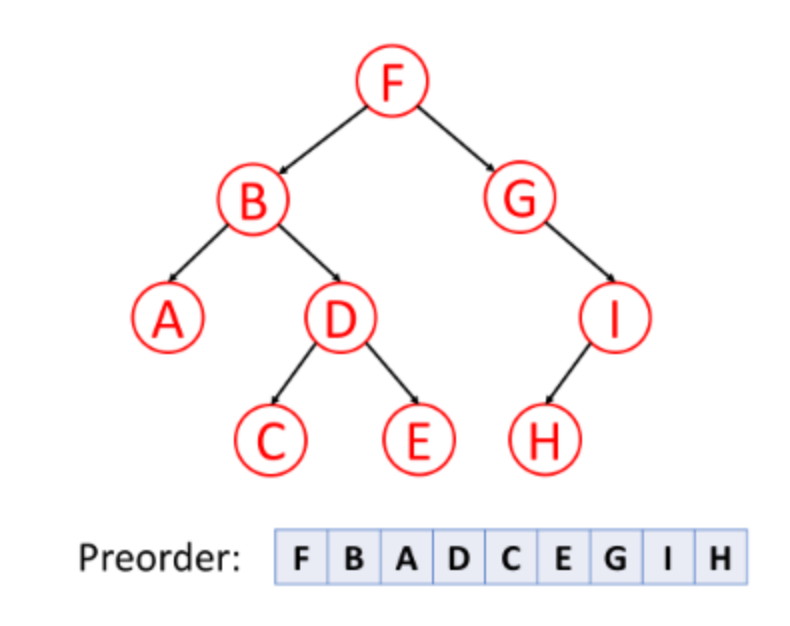
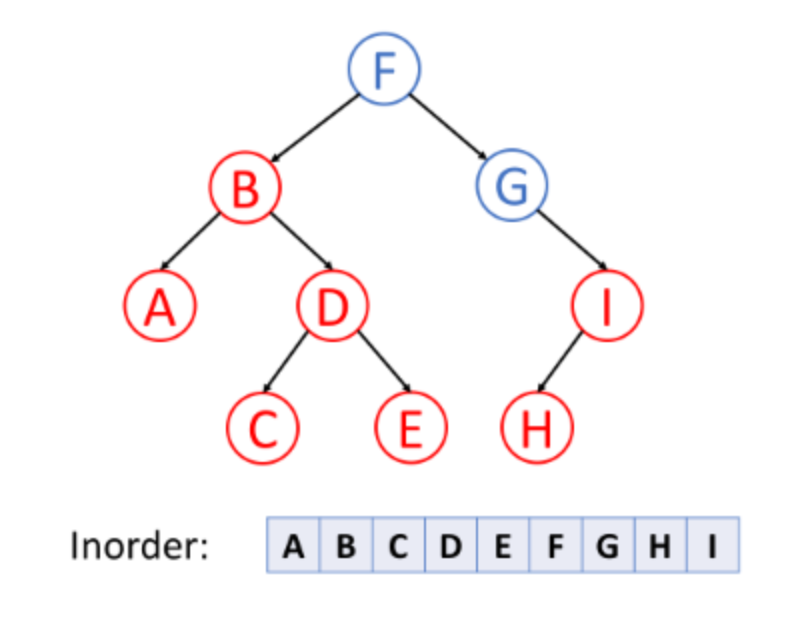
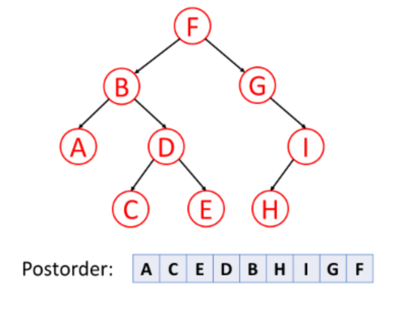

# Binary Trees

## Overview
* A tree is a _directed acyclic graph_ which has `N` nodes and `N-1` edges.
* A binary tree is a tree data structure in which each node has _at most_ two children.

## Tree Traversal
Four methods:
* Pre-order traversal
* In-order traversal
* Post-order traversal
* Recursive or Iterative

### Pre-order Traversal
1. Root
2. Left
3. Right

### In-order Traversal
1. Left
2. Root
3. Right 

**Note:** For _binary search trees_ (a special kind of binary tree), we can retrieve all data in sorted order using in-order traversal.

### Post-order Traversal
1. Left
2. Right
3. Root

